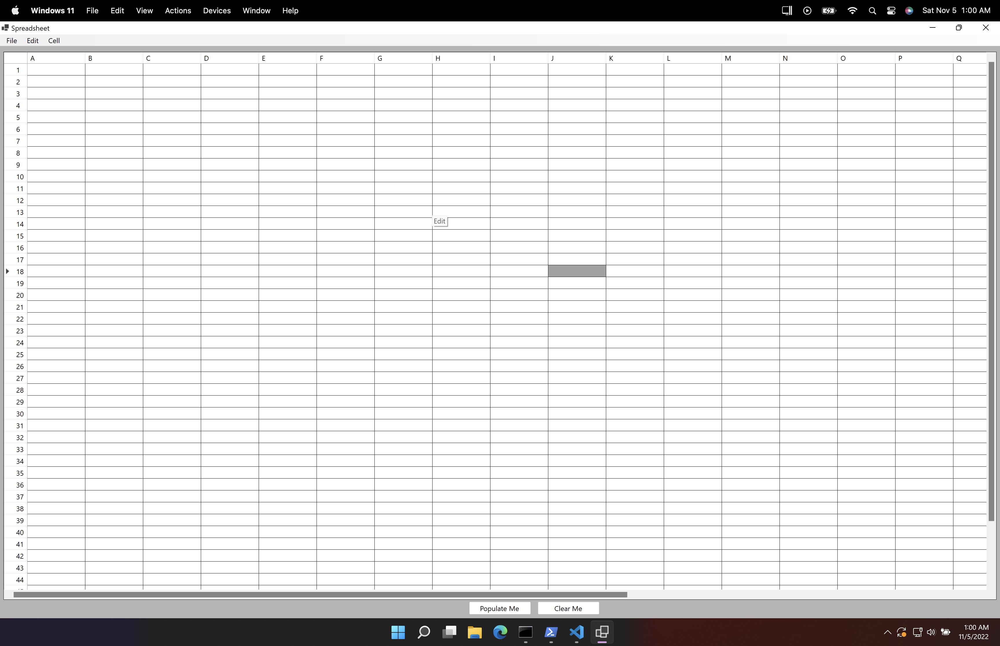
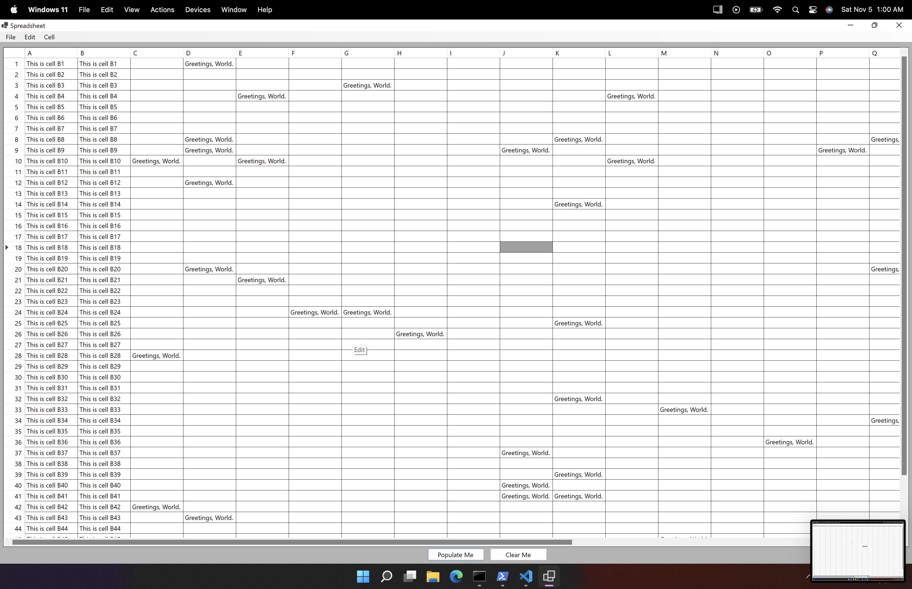
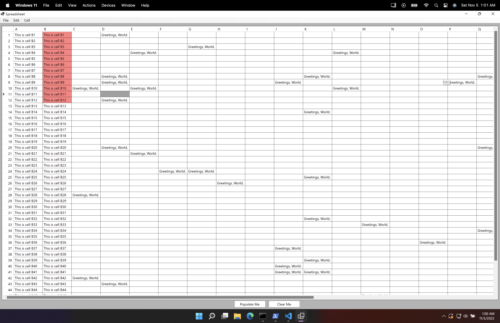

# Spreadsheet Application

The spreadsheet application is a Windows App design with Winforms
that allows you to save and load spreadsheets, modify the color
of cells, perform arithmetic operations, and reference other cells.
Additionally, it supports the ability to undo and redo actions
performed in the app.

## How To Build

Build Solution: `dotnet build`  
Run Tests: `dotnet test .\Spreadsheet-Kyle-Hurd\SpreadsheetEngine.Test\`  
Run UI: `dotnet run --project .\Spreadsheet-Kyle-Hurd\Spreadsheet-UI\`  
Run Console For Expression Tree: `dotnet.exe run --project .\Spreadsheet-Kyle-Hurd\ExpressionTreeConsole\`

## Examples of Program

Blank Spreadsheet

Populated Spreadhseet

Colorized Spreadsheet
