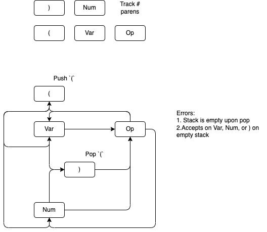

# Cpts-321-Project

Kyle Hurd
11684695

Build Solution: `dotnet build`  
Run Tests: `dotnet test .\Spreadsheet-Kyle-Hurd\SpreadsheetEngine.Test\`  
Run UI: `dotnet run --project .\Spreadsheet-Kyle-Hurd\Spreadsheet-UI\`  
Run Console For Expression Tree: `dotnet.exe run --project .\Spreadsheet-Kyle-Hurd\ExpressionTreeConsole\`

------

## NOTE:

For one of the test cases, I am utilizing
`Microsoft.VisualStudio.QualityTools.UnitTestFramework`.  

This is a dll that has a path that is version specific:  
`C:\Program Files\Microsoft Visual Studio\2022\Community\Common7\IDE\PublicAssemblies\Microsoft.VisualStudio.QualityTools.UnitTestFramework.dll`

You may have to include it if you are running a different version of VS. Or you can just delete
the reference in `SpreadsheetEngine.Test.csproj` and remove the reference / test in `TestExpressionValidator.cs` as I only used it for one test case.

## Expression Tree State Machine

Below is the implementation to show if an expression is valid.
The machine accepts on an empty stack and on a variable, number,
or closing paren.

